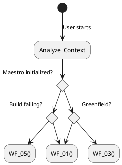

# Maestro Workflow Scenario Index

This index provides quick access to all documented workflow scenarios. Each scenario represents a complete operational workflow showing how users and Maestro interact over time.

---

## Scenario Table

| ID | Title | Tags | Entry Conditions | Exit Conditions | Artifacts | Links |
|----|-------|------|------------------|-----------------|-----------|-------|
| **WF-01** | Existing Repo Bootstrap (Single Main, Compiled) | `bootstrap`, `retrofit`, `compile`, `issues`, `tasks` | • Existing git repo • Single main branch • Compiled language • No Maestro yet | • Maestro initialized • Past work reconstructed • Clean build OR • Issues/tasks created | • `docs/` structure • Issues from build errors • Tasks with dependencies • Initial plan | [Markdown](scenario_01_existing_repo_single_main.md) [PlantUML](scenario_01_existing_repo_single_main.puml) |
| **WF-02** | New Project from Empty Directory (Manual Planning) | `bootstrap`, `greenfield`, `manual-planning`, `work-loop`, `track-phase-task` | • Empty or new directory • Clear plan/requirements • Manual planning preferred • No git repo yet • No Maestro yet | • Maestro initialized • Tracks, phases, tasks created • Work loop operational • Initial work complete/in progress | • `.git/` repository • `docs/maestro/tracks/*.json` • `docs/maestro/phases/*.json` • `docs/maestro/tasks/*.json` • Source files from work | [Markdown](scenario_02_new_project_manual_plan.md) [PlantUML](scenario_02_new_project_manual_plan.puml) |
| **WF-03** | Read-only repo inspection + build | `readonly`, `repo-scan`, `detection`, `build`, `make` | • Existing repository with build files • Required build tools installed • No Maestro initialization required | • Repository scan report produced • Build completed with success/failure status and diagnostics | • None by default (read-only mode) • Optional: scan reports in $HOME/.maestro/repo/ if scanning performed | [Markdown](scenario_03_readonly_repo_inspect_build.md) [PlantUML](scenario_03_readonly_repo_inspect_build.puml) |
| **WF-04** | Reactive compile error → Solutions match → immediate solution-task | `build`, `compile-error`, `solutions`, `reactive`, `issues`, `tasks`, `dependency`, `work-loop` | • Operator runs `maestro make build` • Build process fails with compiler error • Error text contains patterns that may match existing solution rules | • Issue created for the build error • If solution matches: high-priority task created to try solution • If solution fails: fallback task created for normal investigation | • Issue file in docs/issues/ • Task file in docs/tasks/ (if solution matches) • Fallback task file (if solution attempt fails) | [Markdown](scenario_04_reactive_compile_error_solution.md) [PlantUML](scenario_04_reactive_compile_error_solution.puml) |
| **WF-05** | Repo Resolve — packages, conventions, build targets, and derived issues/tasks | `repo`, `resolve`, `detection`, `conventions`, `frameworks`, `build-targets`, `dependencies`, `issues`, `tasks` | • Git repository exists with source code • Maestro installed and accessible • Optional: .maestro/ directory exists • Optional: User config in ~/.config/u++/ide/*.var | • Repository scan results produced in .maestro/repo/ • Optional: Issues and Tasks created for convention violations | • .maestro/repo/index.json • .maestro/repo/index.summary.txt • .maestro/repo/state.json • .maestro/repo/assemblies.json • Issue data files for violations • Task files for addressing violations | [Markdown](scenario_05_repo_resolve_packages_conventions_targets.md) [PlantUML](scenario_05_repo_resolve_packages_conventions_targets.puml) |
| **WF-06** | AI-driven task execution with Work Sessions and multi-session resume | `work`, `ai`, `sessions`, `resume`, `stream-json`, `breadcrumbs`, `ipc`, `state-update` | • Operator has a task to work on (track, phase, issue, or specific task) • AI engine is configured and accessible • Repository is initialized with Maestro | • AI engine completes the task or reaches a stopping condition • Work Session is marked as completed or paused • Task status is updated (DONE if completed, or remains TODO if paused) | • Work Session directory with session.json • Breadcrumb files in session's breadcrumbs directory • AI transcript logs in docs/logs/ai/ • Optional session exports (JSON/Markdown) | [Markdown](scenario_06_ai_task_work_sessions.md) [PlantUML](scenario_06_ai_task_work_sessions.puml) |
| **WF-07** | AST/TU workflows — rename, C++→JS transform, autocomplete | `ast`, `tu`, `translation-unit`, `repo-resolve`, `repo-conf`, `build`, `refactor`, `transform`, `autocomplete` | • Repo Resolve (WF-05) has completed successfully • RepoConf has identified buildable targets/configs • Build succeeds (compile-to-app) for the target package | • AST generated; operation applied or halted safely | • AST index/cache, reports, modified sources | [Markdown](scenario_07_ast_tu_refactor_transform_autocomplete.md) [PlantUML](scenario_07_ast_tu_refactor_transform_autocomplete.puml) |
| **WF-08** | Convert — cross-repo pipeline (New/Plan/Run) | `convert`, `pipeline`, `export`, `cross-repo`, `ast`, `work-sessions`, `ai`, `planning` | • Source repo resolvable + buildable • AST available or generatable • Target repo path specified | • Target repo created • Pipeline executed • Tasks written • Artifacts exported | • Pipelines metadata • AST export • Task plan in target repo • Work sessions/transcripts | [Markdown](scenario_08_convert_cross_repo_pipeline.md) [PlantUML](scenario_08_convert_cross_repo_pipeline.puml) |
| **WF-09** | Storage Contract: Repo Truth vs. Home Hub | `storage`, `truth`, `home-hub`, `readonly`, `policy` | • Any Maestro command is run | • Command completes reads/writes according to storage rules | • `./docs/maestro/` files • `$HOME/.maestro/` files | [Markdown](scenario_09_storage_contract_repo_truth_vs_home_hub.md) [PlantUML](scenario_09_storage_contract_repo_truth_vs_home_hub.puml) |
| **WF-10** | Repo Resolve levels — Lite vs Deep, convention acceptance, and violation policy | `repo-resolve`, `detection`, `lite`, `deep`, `conventions`, `violations`, `issues`, `waivers`, `policy` | • Operator requests `repo resolve` or another workflow triggers it. | • Resolve completes (either Lite or Deep), results are stored, and any required user interactions (like acceptance) are complete or pending. | • Updated Repo Truth Store (`./docs/maestro/`) • New issues created | [Markdown](scenario_10_repo_resolve_levels_lite_deep.md) [PlantUML](scenario_10_repo_resolve_levels_lite_deep.puml) |
| **WF-11** | Manual repo model + manual RepoConf (resolve optional) | `repo`, `manual`, `repo-model`, `repo-conf`, `override`, `build`, `tu` | • A repository exists, but `repo resolve` may be incomplete or undesirable. | • A valid, hand-authored repository model and configuration exist, sufficient for `build` and `tu` to run. | • `./docs/maestro/repo/model.json` • `./docs/maestro/repo/conf.json` | [Markdown](scenario_11_manual_repo_model_and_conf.md) [PlantUML](scenario_11_manual_repo_model_and_conf.puml) |
| **WF-12** | RepoConf gate — required targets/configs for build, TU, and convert | `repo-conf`, `gate`, `build`, `tu`, `ast`, `convert`, `validation`, `targets`, `configs` | • Repository exists with source code • Maestro initialized in repository • Repo model exists (from resolve or manual authoring per WF-11) • No valid RepoConf exists OR existing RepoConf is invalid/outdated | • Valid RepoConf exists and is validated • Default target/config selected and locked • Build, TU, and convert operations can proceed | • `./docs/maestro/repo/conf.json` (or per-package configs) • Validation reports/logs • Default target selection metadata | [Markdown](scenario_12_repo_conf_gate_for_build_tu_convert.md) [PlantUML](scenario_12_repo_conf_gate_for_build_tu_convert.puml) |
| **WF-13** | Read-only → Adopt bridge (home hub to repo truth) | `readonly`, `adopt`, `init`, `home-hub`, `repo-truth`, `import`, `resolve`, `repo-conf` | • Operator is in an existing repository with no Maestro adoption yet • Repository contains buildable code • Maestro is installed and accessible • Read-only mode is supported | • If adopt decision is "No": Nothing repo-local is written, only hub outputs created • If adopt decision is "Yes": `./docs/maestro/**` structure created and populated • RepoConf exists (WF-12) and build can proceed | • `$HOME/.maestro/repo/` outputs during read-only inspection (if performed) • Optionally: `./docs/maestro/tracks/`, `./docs/maestro/phases/`, `./docs/maestro/tasks/`, `./docs/maestro/repo/` | [Markdown](scenario_13_readonly_to_adopt_bridge.md) [PlantUML](scenario_13_readonly_to_adopt_bridge.puml) |
| **WF-14** | Branch safety guardrails — branch-bound state, no branch switching during work | `git`, `branch`, `safety`, `guardrails`, `work`, `sessions`, `corruption-prevention` | • A `maestro work` or stateful session is initiated in a Git repository. | • The work session completes successfully, or is hard-stopped due to a branch mismatch. | • Git identity snapshot stored with work session metadata. | [Markdown](scenario_14_branch_safety_guardrails.md) [PlantUML](scenario_14_branch_safety_guardrails.puml) |
| **WF-15** | Work ↔ wsession cookie protocol (file-based polling, multi-process safe) | `work`, `wsession`, `cookie`, `ipc`, `polling`, `breadcrumbs`, `multi-process` | • A `maestro work` orchestrator run has been initiated for a specific task or workflow. • The AI engine or operator needs to provide updates (e.g., breadcrumbs) to this active `maestro work` run. • The `maestro work` command has started an underlying Python process (or subprocess) to manage the work session. | • The `maestro work` run successfully processes all received updates and completes its task. • The `maestro work` run is explicitly terminated or encounters a critical error. • All `wsession` commands targeting the work-run have completed their write operations. | • `docs/sessions/<session_id>/session.json` • `docs/sessions/<session_id>/breadcrumbs/<depth_level>/<timestamp>.json` | [Markdown](scenario_15_work_wsession_cookie_protocol.md) [PlantUML](scenario_15_work_wsession_cookie_protocol.puml) |
| **WF-16** | wsession modes — log-only vs mutation API (opt-in) | `wsession`, `mutation`, `breadcrumbs`, `audit`, `policy`, `work`, `ipc` | • A Maestro work-run is active, and the `wsession` utility is invoked, either directly by a user or programmatically by an AI agent. | • The `wsession` operation completes, either by successfully logging an event or mutating state (if permitted), or by failing due to policy violation or error. | • If log-only: new entries appended to the active Work Session log. • If mutation: new entries appended to the active Work Session log, and modifications to `docs/maestro/**`. | [Markdown](scenario_16_wsession_mutation_modes.md) [PlantUML](scenario_16_wsession_mutation_modes.puml) |
---

## Scenario Status Legend

- **Published**: Complete, tested, ready for use
- **Draft**: In progress, subject to change
- **Proposed**: Planned but not yet started
- **Deprecated**: Superseded by newer scenario

Current status:
- **WF-01**: Published (first release)
- **WF-02**: Published
- **WF-03**: Published
- **WF-04**: Published
- **WF-05**: Published
- **WF-14**: Published
- **WF-15**: Published
- **WF-16**: Draft

---

## Planned Scenarios (Roadmap)

The following scenarios are planned but not yet documented:

### Repository Types
- **WF-02**: Existing Repo with Feature Branches
  - Tags: `bootstrap`, `branches`, `merge-conflicts`
  - Handles multi-branch workflows, stale branches, merge conflicts

- **WF-04**: New Greenfield Repo
  - Tags: `bootstrap`, `new-project`, `scaffolding`
  - Starting from scratch with Maestro from day one

- **WF-06**: Multi-Language Monorepo
  - Tags: `bootstrap`, `monorepo`, `multi-toolchain`
  - Polyglot projects with multiple build systems

### Error Handling Workflows
- **WF-04**: Runtime Error Workflow
  - Tags: `runtime`, `debugging`, `log-analysis`
  - App runs but produces errors at runtime; log scanning and issue generation

- **WF-07**: Warning Policy Workflow
  - Tags: `warnings`, `policy`, `thresholds`
  - Handling compiler/linter warnings with configurable thresholds

- **WF-08**: Test Failure Workflow
  - Tags: `testing`, `ci-cd`, `regression`
  - Test suite fails; analyzing failures, creating targeted fix tasks

### Enhancement Workflows
- **WF-09**: Refactoring Workflow
  - Tags: `refactor`, `tech-debt`, `safety`
  - Planned refactoring with test coverage validation

### Advanced Scenarios
- **WF-10**: Dependency Update Workflow
  - Tags: `dependencies`, `security`, `compatibility`
  - Updating external dependencies; handling breaking changes

- **WF-11**: Performance Optimization Workflow
  - Tags: `performance`, `profiling`, `benchmarks`
  - Profile-guided optimization with before/after metrics

- **WF-12**: Security Audit Workflow
  - Tags: `security`, `audit`, `vulnerabilities`
  - Security scanning and vulnerability remediation

---

## Scenario Trigger Mapping

This table shows which scenarios are triggered by which conditions:

| Trigger Condition | Applicable Scenarios |
|-------------------|---------------------|
| No Maestro initialized | WF-01, WF-02, WF-04, WF-06 |
| Build fails | WF-01, WF-02, WF-06 |
| Runtime error detected | WF-04 |
| Tests fail | WF-08 |
| Repository analysis needed | WF-05 |
| Warnings exceed threshold | WF-07 |
| Dependency alert | WF-10 |
| Performance regression | WF-11 |
| Security scan alert | WF-12 |
| Need repo inspection without state | WF-03 |

---

## Cross-Scenario Flow Examples

Scenarios can chain together in real workflows:

### Example 1: Fresh Bootstrap → Feature Work
1. **WF-01**: Existing Repo Bootstrap
   - User runs `maestro init` on existing codebase
   - Build errors found, issues/tasks created
   - Exit: Clean build achieved
2. **WF-05**: Repo Resolve (for repository understanding)
   - Repository structure and conventions analyzed
   - Dependencies mapped for feature implementation

### Example 2: Bootstrap → Ongoing Maintenance
1. **WF-01**: Existing Repo Bootstrap
2. **WF-08**: Test Failure Workflow (tests start failing)
3. **WF-10**: Dependency Update Workflow (update causes new issues)
4. **WF-05**: Feature Request Workflow (add related feature)

### Example 3: Runtime Debugging → Performance Optimization
1. **WF-04**: Runtime Error Workflow
   - Logs show errors and performance issues
2. **WF-11**: Performance Optimization Workflow
   - Profile and optimize hotspots
3. **WF-08**: Test Failure Workflow
   - Regression tests catch optimization bug

### Example 4: Read-only Inspection → Full Bootstrap
1. **WF-03**: Read-only repo inspection + build
   - Operator inspects repository structure without Maestro state
   - Build verification performed to understand current state
2. **WF-01**: Existing Repo Bootstrap
   - Proceed with full Maestro initialization based on inspection results
3. **WF-05**: Repo Resolve (for comprehensive repository analysis)
   - Perform detailed repository analysis for packages, conventions, and build targets

---

## Quick Reference: Metadata Fields

All scenario metadata blocks include:

- **id**: Scenario identifier (WF-##)
- **title**: Human-readable short title
- **tags**: Categorization tags
- **entry_conditions**: Prerequisites to start this scenario
- **exit_conditions**: Success criteria for completion
- **artifacts_created**: Files/data produced by this scenario
- **failure_semantics**: Hard stops vs recoverable failures
- **follow_on_scenarios**: IDs of scenarios that may logically follow

See [README.md](README.md) for full metadata schema documentation.

---

## Command Workflows

In addition to scenario workflows, this directory contains **command-specific workflow documentation** that describes the internal implementation of individual Maestro commands.

### Command Workflow Table

| Command | Documentation | Diagram | Purpose | Status |
|---------|---------------|---------|---------|--------|
| `maestro work` | [command_work.md](command_work.md) | [command_work.puml](command_work.puml) | Work execution interface - select and execute work items (tracks, phases, issues, tasks) | Published |
| `maestro wsession` | [command_wsession_protocol.md](command_wsession_protocol.md) | N/A | Work session management and breadcrumb communication protocol | Published |
| `maestro wsession` | [command_wsession_mutation.md](command_wsession_mutation.md) | N/A | Analysis of existing `wsession` implementation and proposed mutation modes | Draft |

### Difference from Scenarios

- **Scenarios** document complete user journeys (e.g., "bootstrap existing repo")
- **Command workflows** document the internal logic of a single command
- Command workflows are referenced BY scenarios as implementation details
- See [README.md#command-workflows](README.md#command-workflows) for more information

---

## Usage Notes

### For Users
- Find the scenario that matches your current situation using the "Scenario Trigger Mapping" table
- Follow the linked Markdown file as a step-by-step playbook
- Use the PlantUML diagram for a visual overview

### For Developers
- Use scenarios to understand command contracts and requirements
- Extract test cases from the "Tests implied by this scenario" sections
- Create fixture repos based on scenario entry conditions

### For Documentation Writers
- Follow the conventions in [README.md](README.md)
- Ensure new scenarios are merge-friendly (callable procedures, labeled entry/exit points)
- Update this index when adding new scenarios

---

## Diagram Assembly

All scenario PlantUML files are designed to be assembled into a single massive conditional workflow diagram:

See [README.md#diagram-strategy](README.md#diagram-strategy) for details.

---

## Change Log

| Date | Change | Author |
|------|--------|--------|
| 2025-12-25 | Initial creation with WF-01 | Claude Sonnet 4.5 |
| 2025-12-25 | Actor model refactor (Operator model), add WF-02, add command workflows | Claude Sonnet 4.5 |

---

## Related Documentation

- [README.md](README.md) - Workflow documentation conventions and strategy
- [_shared.puml](_shared.puml) - Shared PlantUML macros and styles
- [../CLAUDE.md](../CLAUDE.md) - Agent instructions and policy requirements
- Active tasks tracked in JSON storage
- Completed tasks tracked in JSON storage
